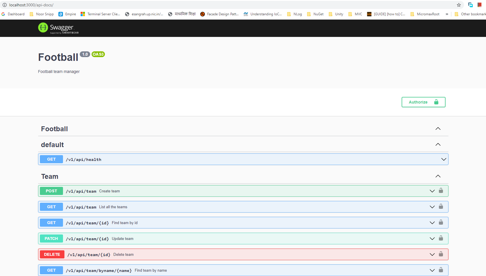
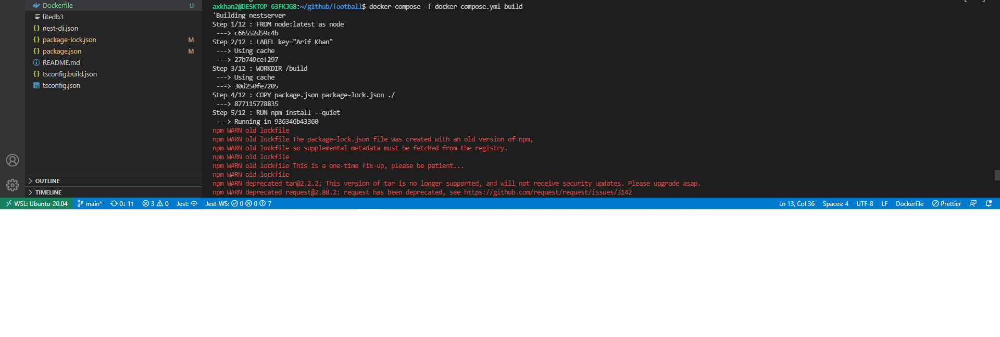
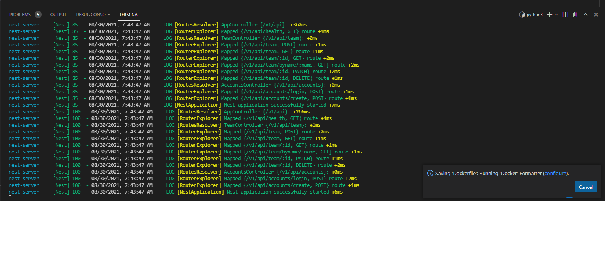
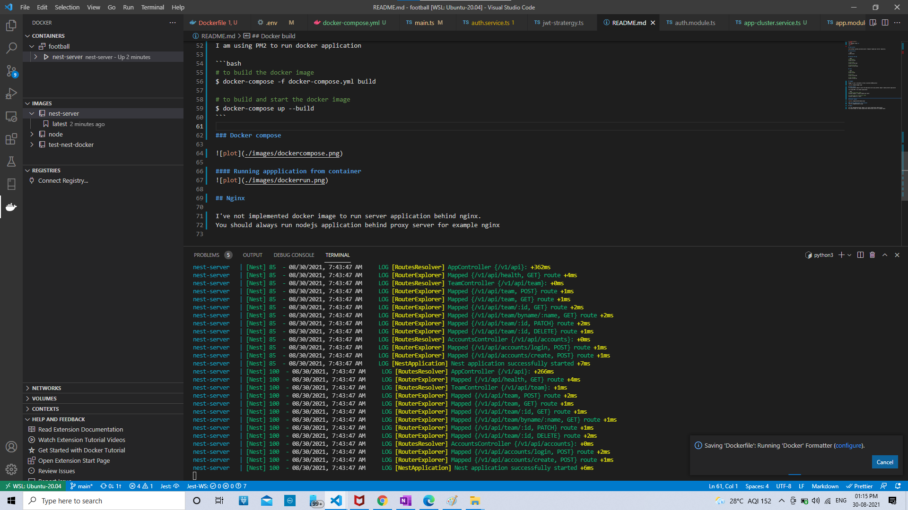

<p align="center">
<center>
<h1> Football Team</h1>
</center>
</p>

## Description

[Nest](https://github.com/nestjs/nest) framework TypeScript starter repository.

## Installation

```bash
$ npm install
```

## Running the app

```bash
# development
$ npm run start

# watch mode
$ npm run start:dev

# production mode
$ npm run start:prod
```

## Test

```bash
# unit tests
$ npm run test

# e2e tests
$ npm run test:e2e

# test coverage
$ npm run test:cov
```

## Swagger

Swagger is api is available at http://localhost:3000/api-docs



## Docker build

I'm using docker image to build the application and using another image to deploy docker application

I am using PM2 to run docker application

```bash
# to build the docker image
$ docker-compose -f docker-compose.yml build

# to build and start the docker image
$ docker-compose up --build
```

### Docker compose



#### Running appplication from container



#### Running appplication from container



## Nginx

I've not implemented docker image to run server application behind nginx.
You should always run nodejs application behind proxy server for example nginx
